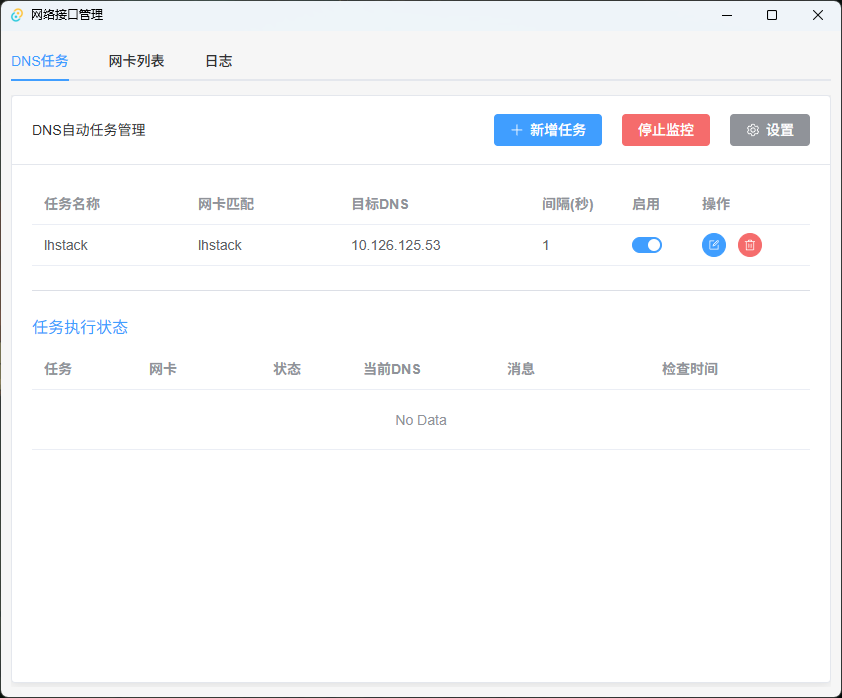
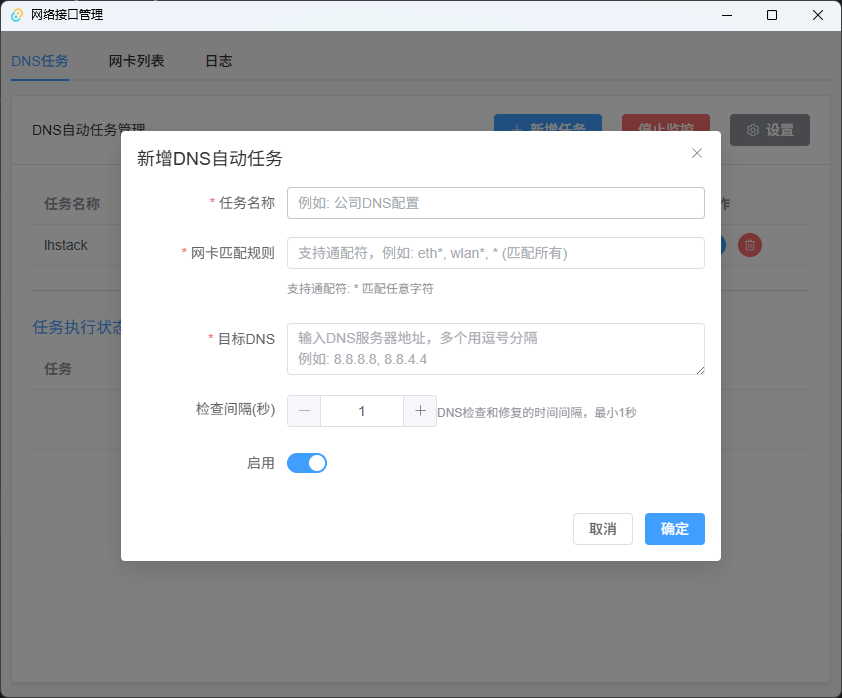
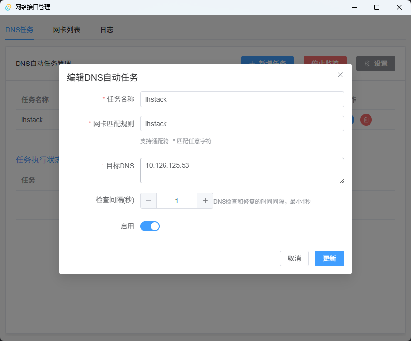
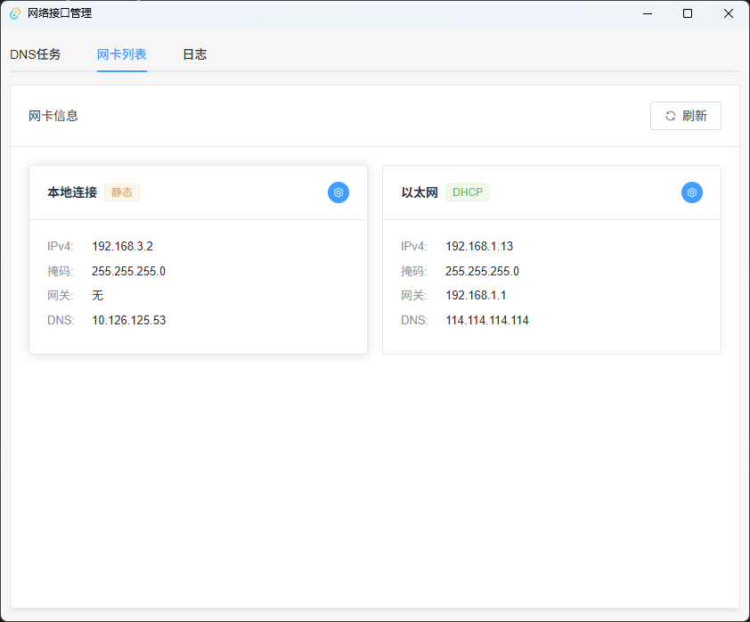
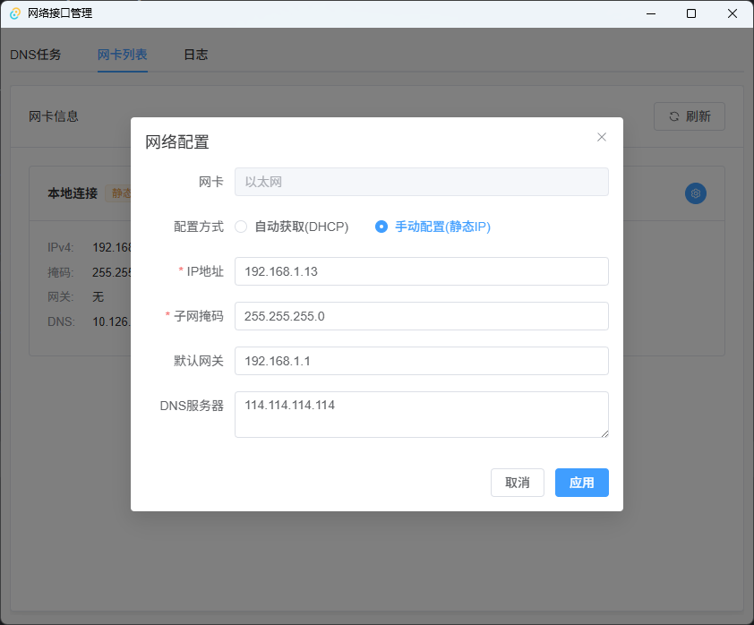
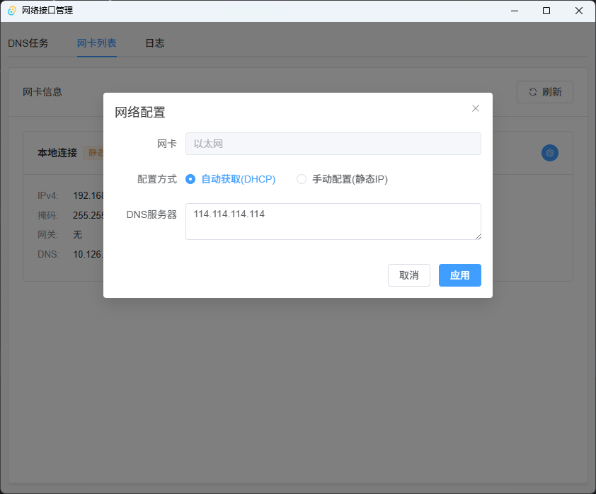
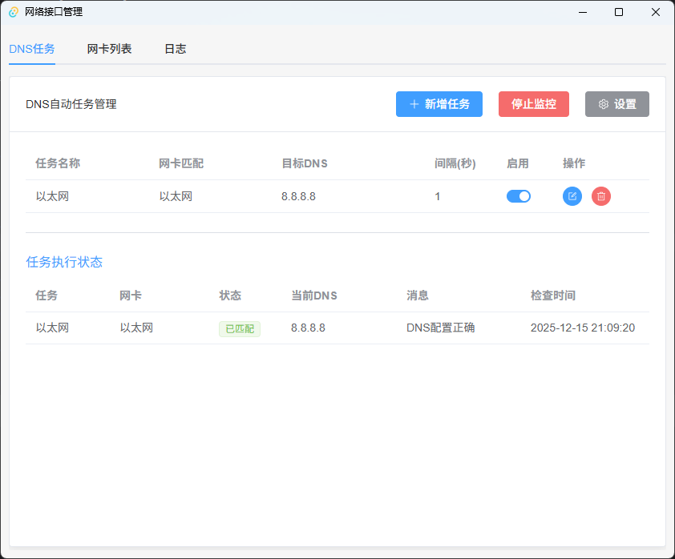
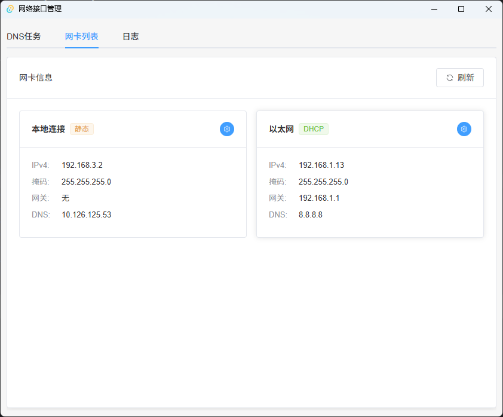
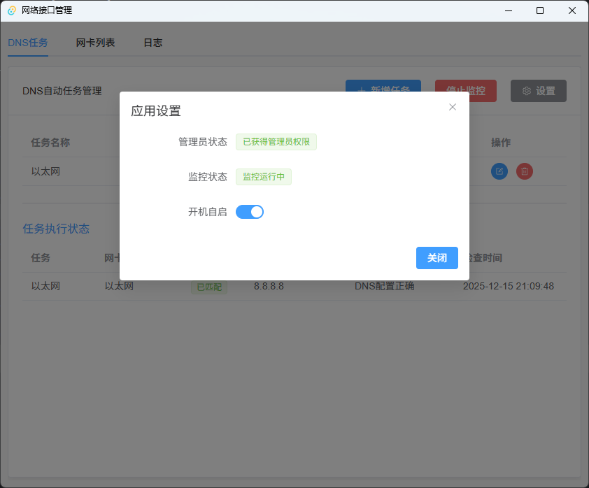

# 网络接口管理器 (Network Interface Manager)

一个跨平台的网络接口管理应用，支持 Windows、Linux 和 macOS。提供网络接口信息查看、DHCP/静态IP配置、DNS 配置和自动任务管理功能。

## ✨ 主要功能
## 图片










### 🖥️ 网络接口管理
- 显示所有网络接口详细信息
- 实时显示网卡名称、MAC 地址、IP 地址、子网掩码、网关
- 支持 IPv4 和 IPv6 地址显示
- 显示当前 DNS 配置和 DHCP 状态
- 网卡列表按 GUID 排序，保持稳定顺序

### 🌐 网络配置
- **DHCP 模式**: 自动获取 IP 地址
- **静态 IP 模式**: 手动配置 IP 地址、子网掩码、网关
- **DNS 配置**: 支持多个 DNS 服务器
- 实时应用网络设置
- 跨平台支持（Windows、Linux、macOS）

### 🤖 DNS 自动任务管理
- 创建 DNS 自动监控任务
- 支持网卡名称通配符匹配（如 `eth*`、`wlan*`、`*`）
- 可配置检查间隔（最小 1 秒）
- 后台自动监控和修复 DNS 配置
- 任务启用/禁用控制
- 实时任务执行状态和日志显示

### 📝 日志系统
- 记录所有 DNS 任务执行日志
- 显示任务名称、时间、操作结果
- 最多保留 100 条日志
- 支持清空日志

### 💾 数据持久化
- SQLite 数据库存储任务配置
- 应用重启后自动恢复任务和监控状态
- 数据存储在可执行文件同目录或用户目录

### 🎯 系统集成
- 系统托盘支持（最小化到托盘）
- 开机自启配置
- 管理员权限自动提升（Windows）
- 后台运行支持
- 任务栏图标动态显示

## 🚀 快速开始

### 系统要求

- **Windows**: Windows 7 或更高版本
- **Linux**: 任何现代 Linux 发行版
- **macOS**: macOS 10.13 或更高版本

### 权限要求

- **Windows**: 需要管理员权限（自动 UAC 提升）
- **Linux**: 需要 root 权限（使用 `sudo`）
- **macOS**: 需要 sudo 权限

### 安装

1. 从 [Releases](https://github.com/lhstack/network-interface-manager/releases) 页面下载最新版本
2. 解压并运行应用

### 使用指南

#### 查看网络接口
1. 启动应用，切换到"网卡列表"标签页
2. 每张网卡显示为一个卡片，包含：
   - 网卡名称和 DHCP/静态 状态标签
   - IPv4 地址、子网掩码、网关、DNS 服务器

#### 配置网络
1. 点击网卡卡片右上角的设置按钮
2. 选择"网络配置"
3. 选择配置方式：
   - **自动获取(DHCP)**: 自动从 DHCP 服务器获取 IP
   - **手动配置(静态IP)**: 填写 IP 地址、子网掩码、网关
4. 可选填写 DNS 服务器（留空则自动获取）
5. 点击"应用"保存设置

#### 仅配置 DNS
1. 点击网卡卡片右上角的设置按钮
2. 选择"设置 DNS"
3. 输入 DNS 服务器地址（多个用逗号分隔）
4. 点击"确定"应用设置

#### 创建 DNS 自动任务
1. 切换到"DNS任务"标签页
2. 点击"新增任务"按钮
3. 填写任务信息：
   - **任务名称**: 任意名称（如"公司DNS配置"）
   - **网卡匹配规则**: 支持通配符（如 `以太网`、`WLAN*`、`*`）
   - **目标 DNS**: 要设置的 DNS 服务器（如 `8.8.8.8, 8.8.4.4`）
   - **检查间隔**: 检查频率（秒），最小 1 秒
4. 点击"确定"保存任务

#### 启动监控
1. 点击"启动监控"按钮
2. 系统开始后台扫描和自动修复 DNS
3. 在"任务执行状态"表格中查看实时状态
4. 切换到"日志"标签页查看详细执行日志

#### 最小化到托盘
1. 点击窗口关闭按钮，应用最小化到系统托盘
2. 左键点击托盘图标：切换显示/隐藏窗口
3. 右键点击托盘图标：显示菜单（退出）

#### 开机自启
1. 点击"设置"按钮
2. 启用"开机自启"开关
3. 应用会在系统启动时自动运行

## 📋 功能详解

### 通配符匹配规则

| 规则 | 说明 | 示例匹配 |
|------|------|----------|
| `*` | 匹配所有网卡 | 所有网卡 |
| `以太网*` | 匹配以"以太网"开头的网卡 | `以太网`、`以太网 2` |
| `WLAN*` | 匹配以 WLAN 开头的网卡 | `WLAN`、`WLAN 2` |
| `以太网` | 精确匹配 | 仅 `以太网` |

### 任务状态说明

| 状态 | 颜色 | 说明 |
|------|------|------|
| 已匹配 | 绿色 | DNS 已匹配目标配置 |
| 已应用 | 橙色 | DNS 已自动修复 |
| 运行中 | 蓝色 | 等待下次检查 |
| 已停止 | 灰色 | 任务已禁用 |
| 不匹配 | 红色 | DNS 设置失败 |

### 数据库位置

数据库文件优先存储在可执行文件同目录，如果无写入权限则存储在用户目录：

- **Windows**: `{exe目录}\network_manager.db` 或 `C:\Users\{username}\.network-interface-manager\network_manager.db`
- **Linux**: `{exe目录}/network_manager.db` 或 `/home/{username}/.network-interface-manager/network_manager.db`
- **macOS**: `{exe目录}/network_manager.db` 或 `/Users/{username}/.network-interface-manager/network_manager.db`

## 🛠️ 开发

### 技术栈

- **前端**: Vue 3 + Element Plus + Vite
- **后端**: Rust + Tauri 2.0
- **数据库**: SQLite (rusqlite)
- **网络信息**: ipconfig (Windows) / 系统命令 (Linux/macOS)
- **DHCP 检测**: Windows API (GetAdaptersInfo)

### 项目结构

```
.
├── src/                          # 前端代码
│   ├── App.vue                   # 主应用组件
│   ├── main.js                   # 入口文件
│   └── assets/                   # 资源文件
├── src-tauri/                    # 后端代码
│   ├── src/
│   │   ├── lib.rs                # 主程序逻辑、Tauri命令
│   │   ├── main.rs               # Tauri 入口
│   │   ├── network_info.rs       # 网络信息获取（跨平台）
│   │   ├── dns_task.rs           # DNS 任务管理器
│   │   └── db.rs                 # SQLite 数据库操作
│   ├── Cargo.toml                # Rust 依赖
│   └── tauri.conf.json           # Tauri 配置
├── docs/                         # 详细文档
├── releases/                     # 发布版本
└── README.md                     # 本文件
```

### 构建

#### 前置要求

- Node.js 18+
- pnpm
- Rust 1.70+
- Tauri CLI 2.0

#### 开发模式

```bash
# 安装依赖
pnpm install

# 启动开发服务器
pnpm tauri dev
```

#### 生产构建

```bash
# 构建应用
pnpm tauri build
```

构建产物位于 `src-tauri/target/release/` 目录。

### 主要依赖

#### 前端
- `vue` ^3.x - 前端框架
- `element-plus` - UI 组件库
- `@tauri-apps/api` ^2.x - Tauri API
- `@tauri-apps/plugin-autostart` - 开机自启插件

#### 后端
- `tauri` 2.x - 应用框架
- `serde` / `serde_json` - 序列化
- `rusqlite` - SQLite 数据库
- `lazy_static` - 全局单例
- `chrono` - 时间处理
- `dirs` - 目录路径
- `ipconfig` - Windows 网络信息
- `is_elevated` - Windows 权限检测
- `winapi` - Windows API 调用

## 📚 文档

详细文档请查看 `docs/` 目录：

- [DNS 任务实现](docs/DNS_TASK_IMPLEMENTATION.md)
- [跨平台支持](docs/CROSS_PLATFORM_SUPPORT.md)
- [系统托盘功能](docs/TRAY_FUNCTIONALITY.md)
- [UAC 权限提升](docs/UAC_ELEVATION.md)
- [管理员和开机自启](docs/ADMIN_AND_AUTOSTART.md)
- [数据库路径](docs/DATABASE_PATH.md)
- [任务持久化](docs/PERSISTENCE_IMPROVEMENTS.md)

## 🐛 故障排查

### 应用无法启动
- **Windows**: 确保以管理员身份运行，或允许 UAC 提升
- **Linux/macOS**: 使用 `sudo` 运行

### DNS 设置失败
- 确保有管理员权限
- 检查 DNS 地址格式是否正确（如 `8.8.8.8`）
- 检查网卡是否启用

### DHCP 状态显示不正确
- 等待几秒后刷新，网络配置变更需要时间生效
- 确保网卡已连接网络

### 任务不执行
- 确保监控已启动（按钮显示"停止监控"）
- 检查任务是否启用（开关打开）
- 检查网卡匹配规则是否正确

### 数据丢失
- 检查数据库文件是否存在
- 确保应用有写入权限

## 🤝 贡献

欢迎提交 Issue 和 Pull Request！

## 📄 许可证

MIT License

## 🙏 致谢

- [Tauri](https://tauri.app/) - 跨平台应用框架
- [Vue.js](https://vuejs.org/) - 前端框架
- [Element Plus](https://element-plus.org/) - UI 组件库
- [network-interface-manager-go](https://github.com/lhstack/network-interface-manager-go) - Go 版本参考实现

---

**⚠️ 注意**: 此应用需要管理员权限才能修改网络配置。请确保以适当的权限运行应用。
